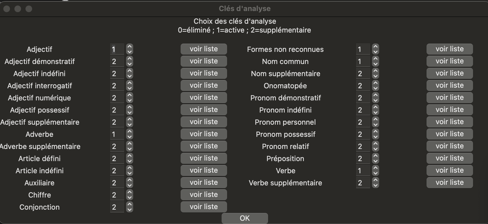

[//]: # (Rôle du fichier: pos_spacy.md documente une partie de l'application IRaMuTeQ-like.)
[//]: # (Ce document sert de référence fonctionnelle/technique pour l'équipe.)
[//]: # (Il décrit le comportement attendu afin de sécuriser maintenance et diagnostics.)
### Analyse morphosyntaxique avec spaCy et Lexique (fr)

- Documentation principale spaCy : <https://spacy.io/usage>
- Linguistic Features (POS, morphology) : <a href="https://spacy.io/usage/linguistic-feature/" target="_blank" rel="noopener noreferrer">Lexique POS spaCy</a>
- Documentation OpenLexicon : <a href="https://openlexicon.fr/" target="_blank" rel="noopener noreferrer">OpenLexicon</a>

### Traduction FR des POS (spaCy)

- **ADJ** : adjectif
- **ADP** : adposition (préposition)
- **ADV** : adverbe
- **AUX** : auxiliaire
- **CCONJ** : conjonction de coordination
- **DET** : déterminant
- **INTJ** : interjection
- **NOUN** : nom
- **NUM** : numéral
- **PART** : particule
- **PRON** : pronom
- **PROPN** : nom propre
- **PUNCT** : ponctuation
- **SCONJ** : conjonction de subordination
- **SYM** : symbole
- **VERB** : verbe
- **X** : autre / catégorie inconnue

### Filtrage morphosyntaxique spécifique lexique_fr

Le dictionnaire **lexique_fr** utilisé ici est celui d’**IRaMuTeQ**, et il semble lui-même issu d’**OpenLexicon**.

> Contrairement au logiciel IRaMuTeQ (où les niveaux sont généralement interprétés comme `1 = active` et `2 = supplémentaire`), le filtrage proposé ici est **binaire** et configurable de plusieurs façons.

Deux configurations principales dans l'interface sont possibles :
1. Si vous **ne cochez pas** le filtrage morphosyntaxique, **tout le corpus** est pris en compte.
2. Si vous **filtrez** sur des catégories morphosyntaxiques (voir la liste ci-dessous), l’analyse porte sur le **corpus filtré** par les catégories sélectionnées.

Noms des catégories de Lexique_fr

- **NOM** : nom commun
- **NOM_SUP** : nom
- **VER** : verbe
- **VER_SUP** : verbe
- **AUX** : auxiliaire
- **ADJ** : adjectif
- **ADJ_SUP** : adjectif
- **ADJ_DEM** : adjectif démonstratif
- **ADJ_IND** : adjectif indéfini
- **ADJ_INT** : adjectif interrogatif
- **ADJ_NUM** : adjectif numéral
- **ADJ_POS** : adjectif possessif
- **ADV** : adverbe
- **ADV_SUP** : adverbe
- **PRE** : préposition
- **CON** : conjonction
- **ART_DEF** : article défini
- **ART_IND** : article indéfini
- **PRO_DEM** : pronom démonstratif
- **PRO_IND** : pronom indéfini
- **PRO_PER** : pronom personnel
- **PRO_POS** : pronom possessif
- **PRO_REL** : pronom relatif
- **ONO** : onomatopée

Flux technique (mode "Lexique_fr"):
1. tokenisation locale (quanteda),
2. filtrage des tokens par présence dans lexique_fr avec les catégories `c_morpho` sélectionnées,
3. lemmatisation (si activée) directement via lexique_fr (forme -> lemme).

> Le filtrage morphosyntaxique lexique_fr est donc indépendant de spaCy.

### Activation de filtrage morphosyntaxique

- de choisir la langue spaCy (`fr`, `en`, `es`, `it`, `de`) quand la source est **spaCy**,
- de sélectionner les POS à conserver parmi la liste POS quand la source est **spaCy**,
- de sélectionner directement les catégories `c_morpho` à conserver quand la source est **Lexique (fr)**,
- de combiner ce filtrage avec la lemmatisation selon les besoins analytiques.
